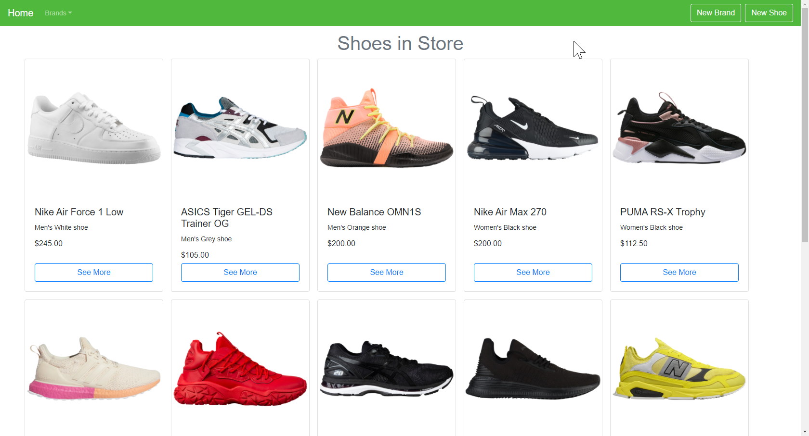
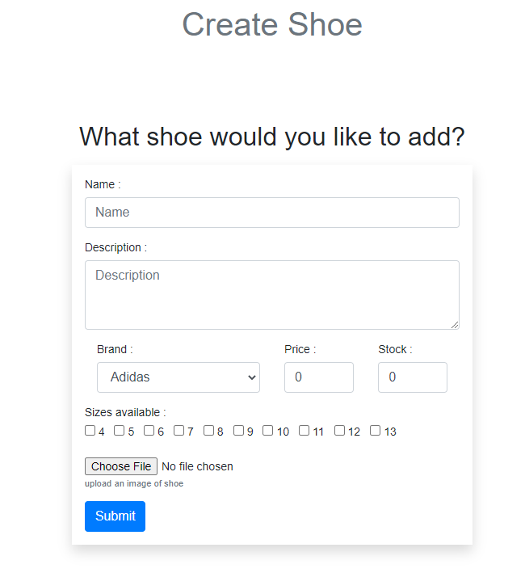
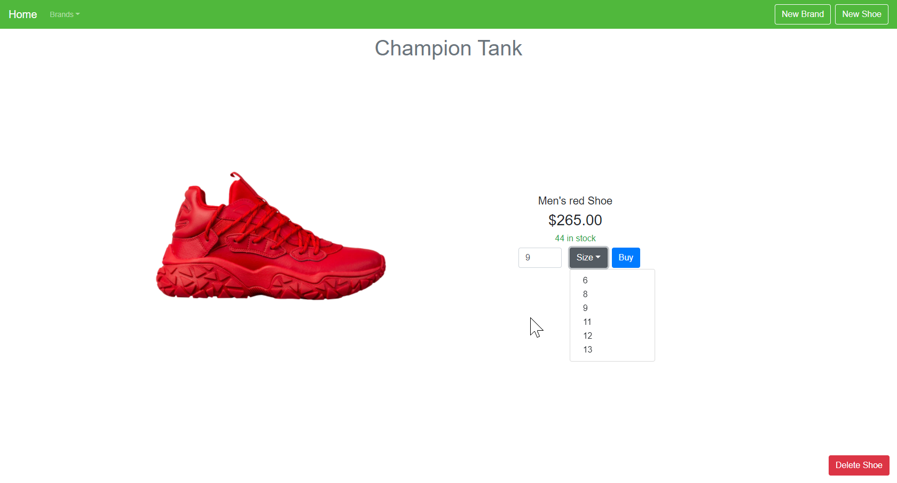
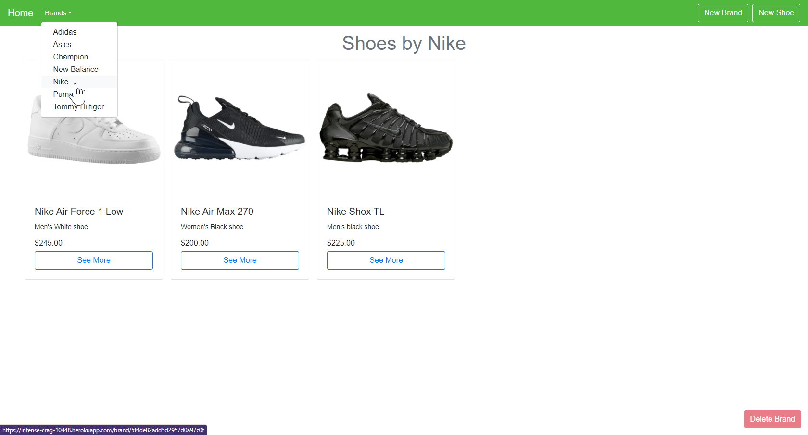

# 
Shoe Store

A simulated online shoe store.

<h3 align="center">
    <a href="https://intense-crag-10448.herokuapp.com/">Visit the live app!</a>
</h3>

## Features

### Creating Shoes
Users can create brands, as well as create shoes (given that the shoe's brand has also been created). Shoes and Brands are stored on a [mongoDB](https://www.mongodb.com/) database, however the images themselves are stored on an [AWS S3](https://aws.amazon.com/s3/) server.

Here we see a shoe being created, requiring a name, description, brand, price, stock, sizes available, and an image of the shoe.

## Viewing and Buying Shoes
Clicking on a shoe brings its to the deatil page. Users can see more information about the shoe and also choose to buy one or more such shoes. This will be allowed until the shoe becomes out of stock. 

## Sorting by Brand
Users can select a particular brand from the dropdown on the navbar to see shoes only by that brand. Brands are automatically added to this list as they are created by users. Brands can be deleted given that they have no shoes attached to them.

